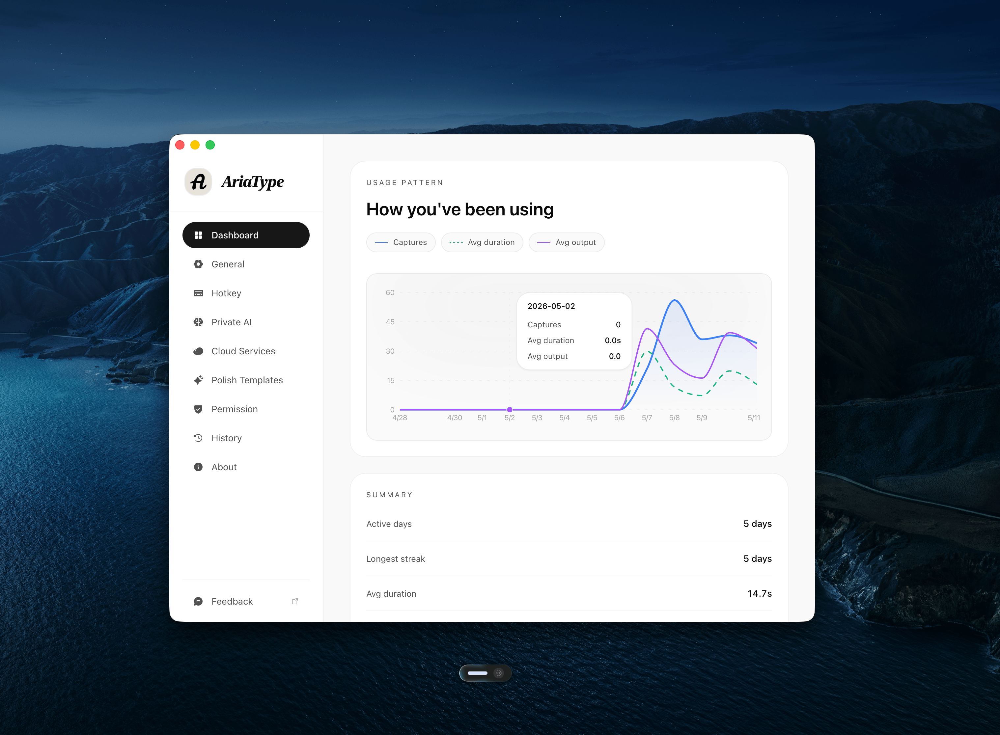

  

  <h1>AriaType</h1>

  <h3>用声音驱动桌面写作、输入和跨应用工作</h3>

  

    AriaType 是桌面上的语音工作层，把你说出口的想法变成贴合上下文的内容，直接落到当前光标位置。
  

  

    回消息、记笔记、写 Prompt、整理文档，都不用离开正在使用的应用。
  

  

    <a href="https://github.com/joe223/AriaType/releases">下载</a>
    ·
    <a href="https://ariatype.com">官网</a>
    ·
    <a href="context/README.md">文档</a>
    ·
    <a href="https://github.com/joe223/AriaType/discussions">讨论区</a>
    ·
    <a href="README.md">English</a>
  

  

    
    
    
    
    
    
  

  

---

## 从写作开始

想到什么，就应该能直接说进眼前的工作里。

AriaType 先从桌面上最高频的写作场景开始：回消息、记想法、写 Prompt、整理口语表达，并把结果直接写进当前应用。

它不只听你说了什么，也会关注你在哪里写、要写到哪里，以及真实说话时的停顿和环境。

## 亮点

- 🔊 **降噪**：过滤环境杂音，让日常语音输入更稳定。
- 🤫 **VAD 语音活动检测**：识别说话、停顿和静音，减少手动控制。
- 🧠 **上下文感知**：结合当前窗口，让输出更贴合应用、输入框和任务。
- ✍️ **AI 润色**：去口头禅、修标点、压缩冗余，把口语变成可用文字。
- 🌏 **多语言**：支持中文、英文、日文、韩文等日常写作场景。
- 🎯 **光标处输入**：不切窗口，不复制粘贴，说完直接写到当前位置。
- 🔒 **安全隐私**：默认本地优先，日常语音内容优先留在自己的设备上。
- 🔌 **自定义服务**：按需接入你偏好的语音或语言服务。
- 🌓 **暗色模式**：支持 Light/Dark 主题，长时间使用也更舒服。
- 🖥️ **自定义悬浮窗口**：调整 Pill Window 和快捷键，让它贴合你的工作习惯。

## 适合这些场景

- **更快回复消息**：在聊天工具、邮件、协作文档和浏览器输入框里直接口述。
- **记录想法**：想法出现时先说出来，不被打字节奏打断。
- **写 Prompt 和工作说明**：用自然语言描述需求，再整理成清楚的文本。
- **整理口语表达**：去掉口头禅，修正标点，压缩冗余。
- **跨应用输入文字**：在不同桌面应用里使用同一套语音方式。
- **结合当前窗口上下文**：让输出更贴合你眼前正在做的任务。
- **默认更重视隐私**：日常使用可以优先走本机处理。

## 为什么体验不一样？

AriaType 面向桌面，而不是单个输入框。

- **在当前应用完成**：文字直接进光标，不需要把内容搬到另一个工具里。
- **按真实说话设计**：支持停顿、静音和日常噪音，不用像录音一样小心翼翼。
- **输出更贴合任务**：可以结合当前窗口上下文，让结果更像你此刻需要的内容。
- **隐私和效果可选**：默认本地优先，也能按需接入自己的语音或语言服务。
- **桌面体验完整**：主题、多语言界面、快捷键、悬浮 Pill Window 都可以按习惯调整。

## 围绕你的桌面设计

AriaType 是桌面上的语音工作层，而不是又一个需要你把工作搬进去的新地方。

它围绕当前应用、当前输入框和当前光标设计：你在哪里工作，它就在哪里把语音变成可用文字。

## 使用方式

1. 安装 AriaType。
2. 授权麦克风和辅助功能权限。
3. 在任意应用中按住快捷键。
4. 自然说话。
5. 松开快捷键，文字自动出现在光标处。

默认情况下，`Cmd + /` 用于原始听写，`Opt + /` 用于智能润色后输入。你也可以在设置里改成自己习惯的快捷键。

## 隐私与权限

AriaType 只请求桌面语音交互所需的系统权限：

- 🎙️ **麦克风**：用于录制你的语音。
- ⌨️ **辅助功能**：用于把文字输入到当前应用。
- 🪟 **屏幕/窗口上下文**：可选启用，主要用于上下文感知，让输出更贴合当前应用、输入框和任务。

AriaType 不要求注册账号，也不默认上传你的语音内容。远端服务是可选功能，只有当你主动配置并启用时才会使用。

## 支持平台

|  | 平台 | 状态 | 要求 |
|---|---|---|---|
|  | macOS Apple Silicon | 稳定可用 | macOS 12.0+ |
|  | macOS Intel | 稳定可用 | macOS 12.0+ |
|  | Windows | 开发中 | 即将推出 |

## 下载

从以下地址下载最新版：

- [GitHub Releases](https://github.com/joe223/AriaType/releases)
- [官方网站](https://ariatype.com)

安装后，根据系统提示授权麦克风和辅助功能权限即可使用。

## 项目状态

AriaType 目前处于持续开发阶段，macOS 版本已经可用，Windows 版本正在开发中。

当前重点：

- 提升语音识别准确率
- 优化中文和多语言体验
- 改进跨应用输入稳定性
- 完善文字润色和自定义模板
- 打磨更安静、更自然、更可自定义的桌面语音体验

如果你也希望语音成为桌面工作的一层入口，欢迎 Star 关注项目进展，也支持我们继续打磨产品。

## 参与贡献

欢迎提交 Issue、参与讨论、反馈产品建议或贡献代码。

你可以参与：

- 反馈语音识别问题
- 提供不同语言、口音和设备下的测试结果
- 改进安装和新手引导体验
- 优化桌面端交互细节
- 增加或改进文字润色模板
- 完善文档和翻译

项目文档入口见：[context/README.md](context/README.md)

## 许可证

AriaType 使用 [AGPL-3.0](LICENSE) 许可证。
