

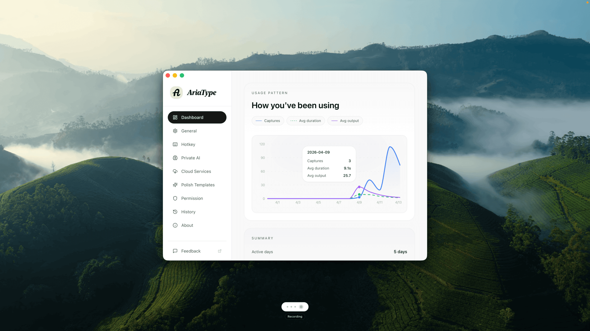

  

### AriaType

AriaType - Entrada por voz con IA y codigo abierto | Una potente alternativa a Typeless

[English](README.md) | [简体中文](README-cn.md) | [日本語](README-ja.md) | [한국어](README-ko.md) | Español

 [-pink)](https://github.com/SparklingSynapse/AriaType/releases) 

[Descargar](https://github.com/SparklingSynapse/AriaType/releases) • [Docs](docs/README.md) • [Discusiones](https://github.com/SparklingSynapse/AriaType/discussions) • [Web](https://ariatype.com)

---

## Qué es

AriaType es una app de dictado por voz para macOS, con un enfoque claramente local-first.

Se queda en segundo plano y aparece justo cuando la necesitas. Mantienes pulsada una hotkey global, hablas con naturalidad y sueltas. Tu voz se convierte en texto dentro de la app activa. Es, en la práctica, un teclado de voz con IA pensado para usar a diario en documentos, chats, notas, código y cualquier flujo donde hablar sea más rápido que escribir.

## Funciones y puntos fuertes

- 🎙 Dictado con hotkey global: por defecto usa `Shift+Space`, así que puedes pulsar, hablar y soltar sin romper el ritmo.
- ↔️ Inserción directa en cualquier app: el texto entra en la app activa, como VS Code, Slack, Notion o el navegador.
- 🔒 Privacidad local-first: el reconocimiento de voz y la limpieza del texto se ejecutan en tu equipo por defecto.
- ⚡ Doble motor STT local: elige entre `Whisper` y `SenseVoice` según idioma, velocidad y precisión.
- 🌍 Compatibilidad con 100+ idiomas: puedes usar detección automática o fijar manualmente el idioma de salida.
- 🇨🇳 Mejor ajuste para chino y CJK: `SenseVoice` destaca especialmente en mandarín, chino tradicional, cantonés y flujos centrados en CJK.
- ✨ Más que transcripción: añade puntuación, quita muletillas, ajusta el tono y compacta frases antes de insertar el texto final.
- 🧩 Plantillas de polish: incluye `Remove Fillers`, `Formal Style`, `Make Concise` y `Agent Prompt`, además de plantillas personalizadas.
- ☁️ Refuerzo en la nube cuando lo necesitas: en `Cloud Services` puedes activar `Cloud STT` y `Cloud Polish` por separado.
- 📡 Transcripción parcial en streaming: los proveedores cloud compatibles devuelven texto parcial mientras todavía estás hablando.
- 🧠 Dominio y glosario: mejora el reconocimiento con dominios, subdominios, prompt inicial y términos personalizados.
- 🧭 Recomendación de modelos por idioma: la app puede sugerirte mejores modelos según el idioma que vayas a usar.
- 📍 Cápsula siempre visible: una cápsula flotante muestra en tiempo real estados de grabación, transcripción, polish y nivel de audio.
- ⚙️ Control de visibilidad y posición: puedes dejar la cápsula siempre visible, mostrarla solo al grabar, ocultarla o moverla.
- 🎛 Canal de audio ajustable: regula reducción de ruido y recorte de silencios (VAD) según tu sala, micrófono y forma de hablar.
- 📝 Inserción de texto más robusta: prioriza la escritura simulada por teclado y, si hace falta, usa el portapapeles y lo restaura después.
- 🔎 Historial local con búsqueda: guarda tus transcripciones en local para buscarlas y reutilizarlas más tarde.
- 📊 Panel de uso: consulta capturas, tiempo de reconocimiento, uso local frente a cloud y rachas de uso.
- ⬇️ Gestión de modelos: descarga, elimina y revisa el estado de los modelos locales con indicador de progreso.
- 🎨 Detalles pensados para escritorio: cambio de tema, inicio automático, hotkeys personalizadas y modos de grabación hold/toggle.

## Capturas de pantalla

<table>
  <tr>
    <td width="50%">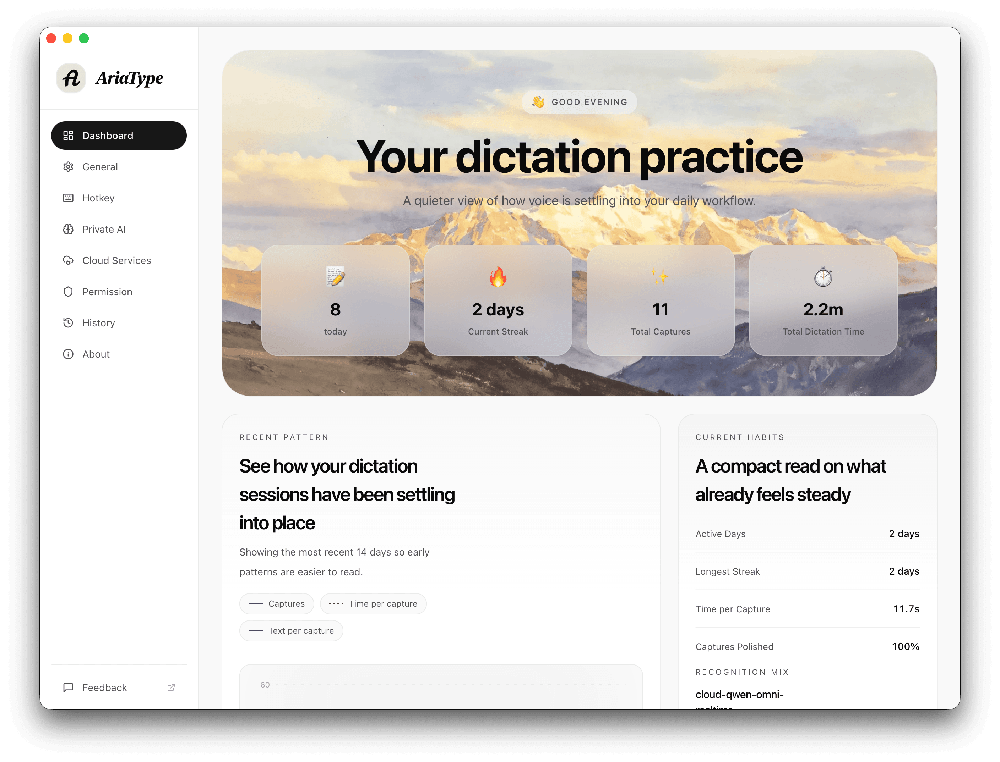</td>
    <td width="50%">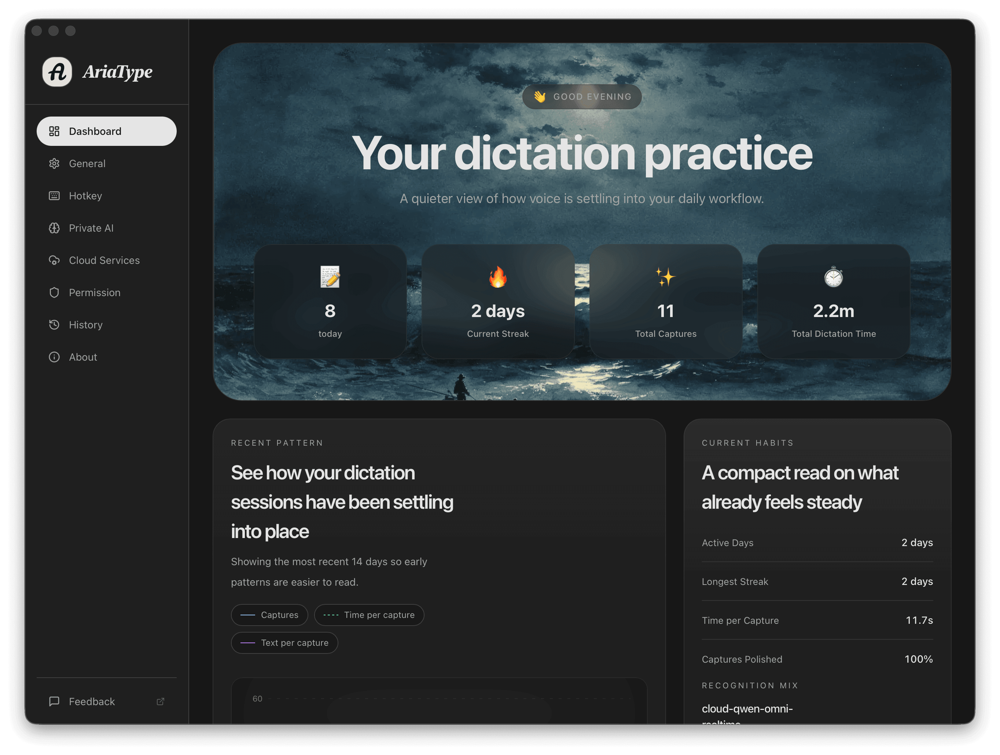</td>
  </tr>
  <tr>
    <td><strong>Inicio, tema claro</strong> El espacio principal para escribir con la voz, con acceso rápido a ajustes y actividad reciente.</td>
    <td><strong>Inicio, tema oscuro</strong> La misma experiencia en un entorno más cómodo para sesiones largas.</td>
  </tr>
  <tr>
    <td width="50%">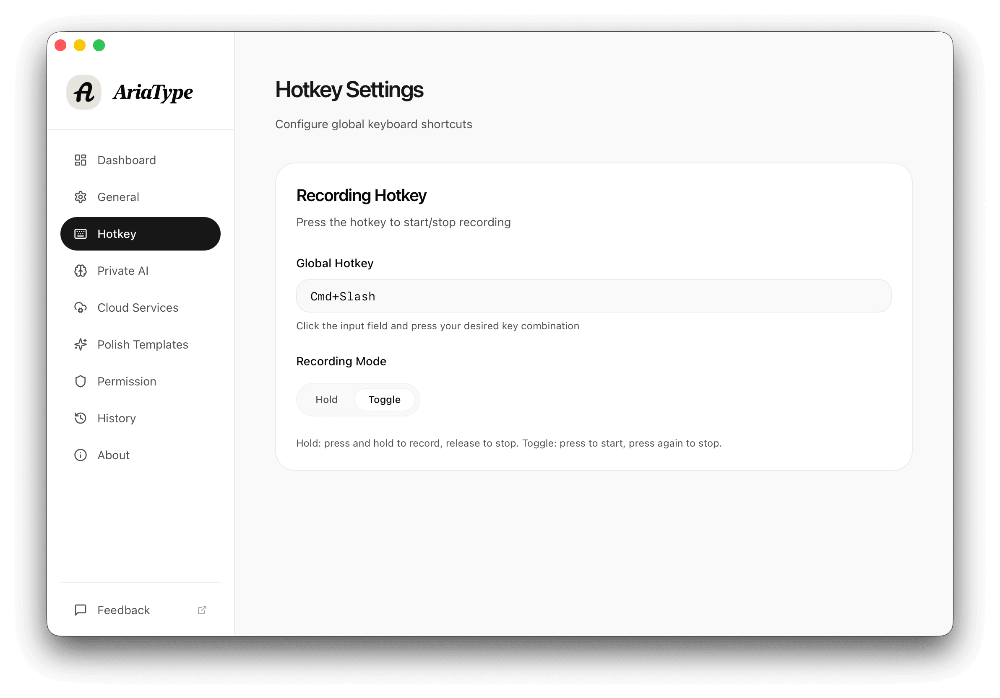</td>
    <td width="50%">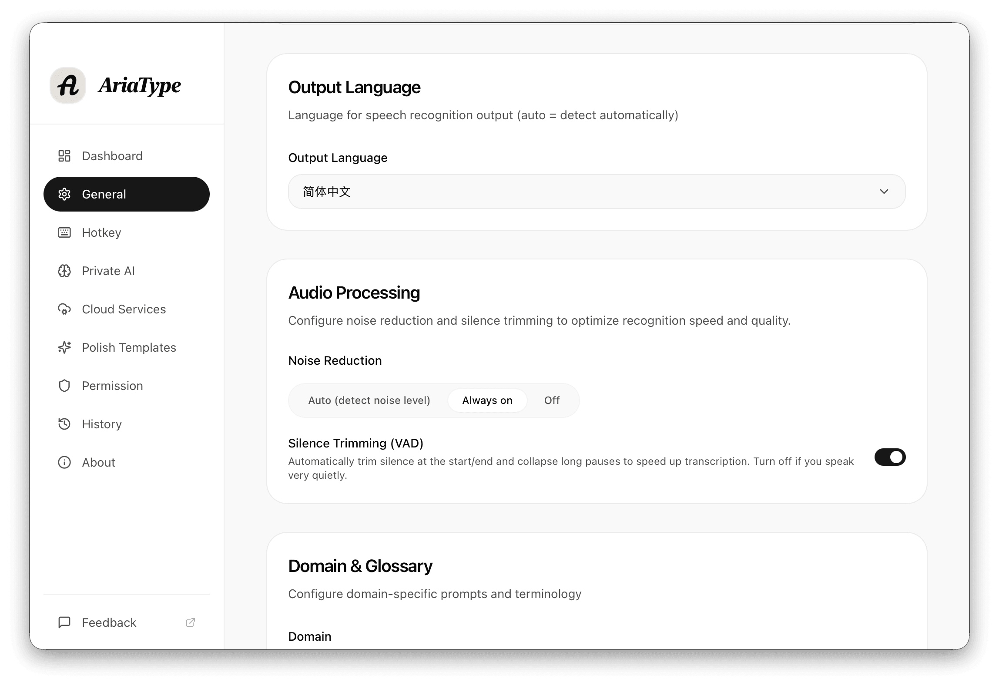</td>
  </tr>
  <tr>
    <td><strong>Hotkeys y grabación</strong> Personaliza atajos y elige entre mantener pulsado para grabar o usar modo toggle.</td>
    <td><strong>Procesamiento de audio</strong> Ajusta reducción de ruido y recorte de silencios según tu entorno y tu voz.</td>
  </tr>
  <tr>
    <td width="50%">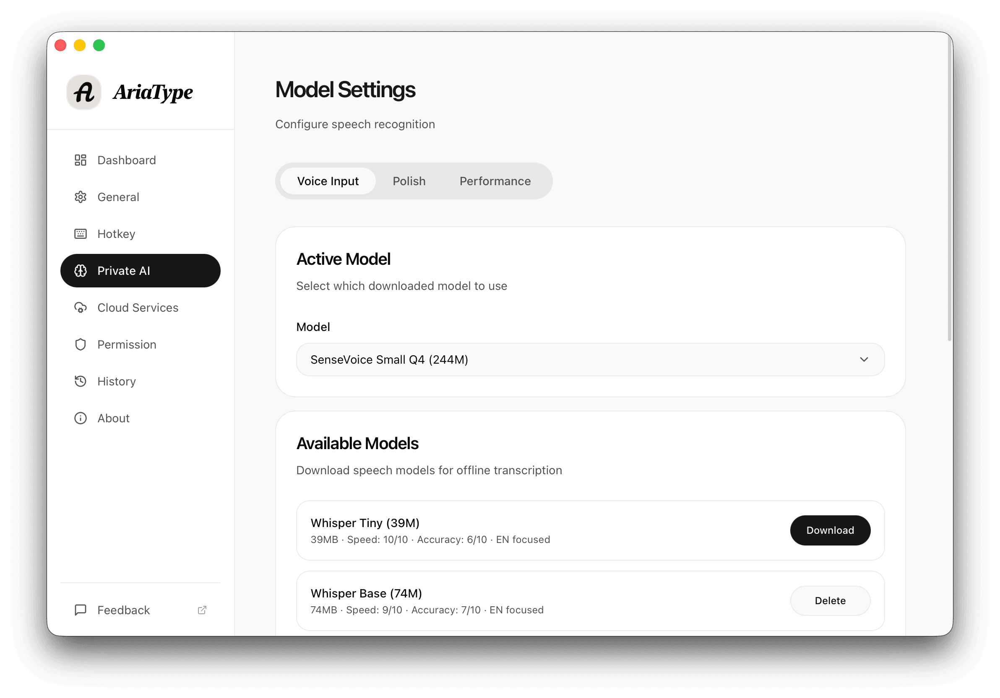</td>
    <td width="50%">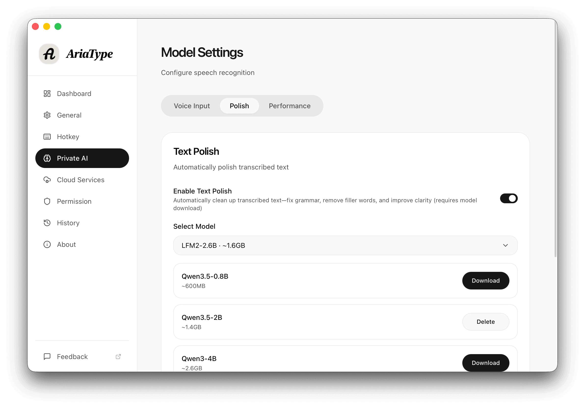</td>
  </tr>
  <tr>
    <td><strong>Modelos STT locales</strong> Descarga y gestiona modelos `Whisper` y `SenseVoice` para transcribir sin conexión.</td>
    <td><strong>Modelos de polish locales</strong> Usa opciones como `Qwen`, `LFM` y `Gemma` para limpiar y reescribir texto en local.</td>
  </tr>
  <tr>
    <td width="50%">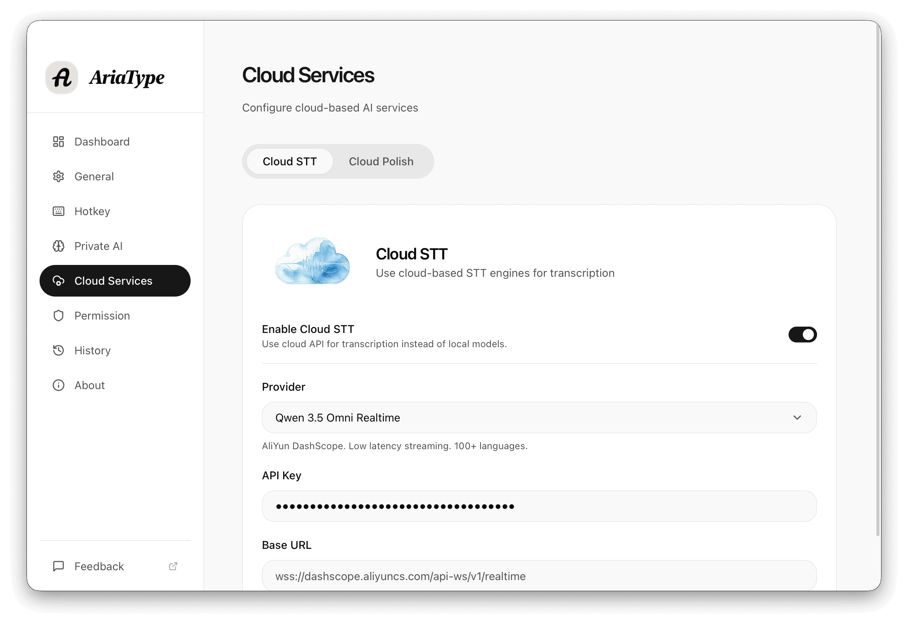</td>
    <td width="50%">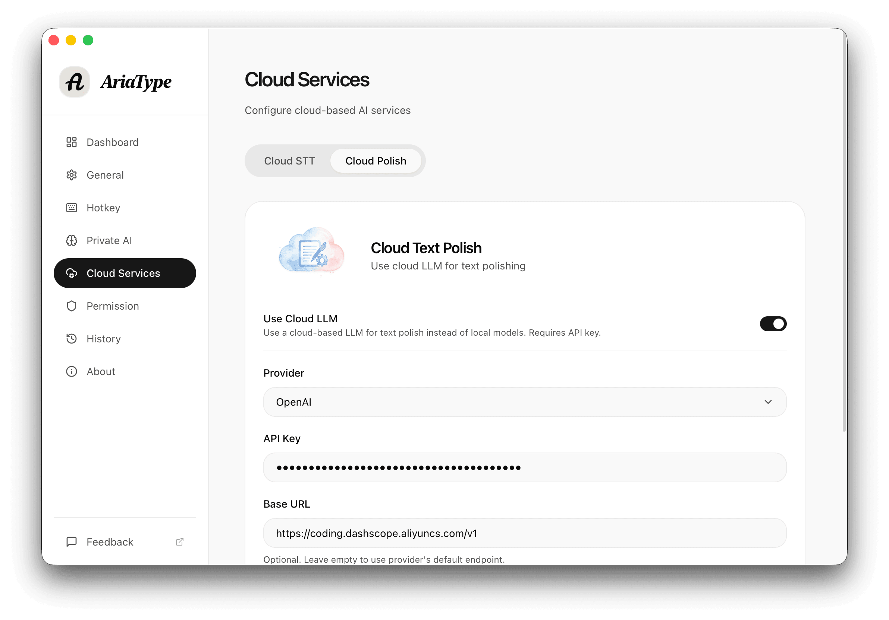</td>
  </tr>
  <tr>
    <td><strong>Cloud STT</strong> Añade tu propia API Key y activa transcripción cloud solo cuando te compense.</td>
    <td><strong>Cloud Polish</strong> Conecta tu proveedor para obtener una limpieza y reescritura más potentes.</td>
  </tr>
  <tr>
    <td width="50%">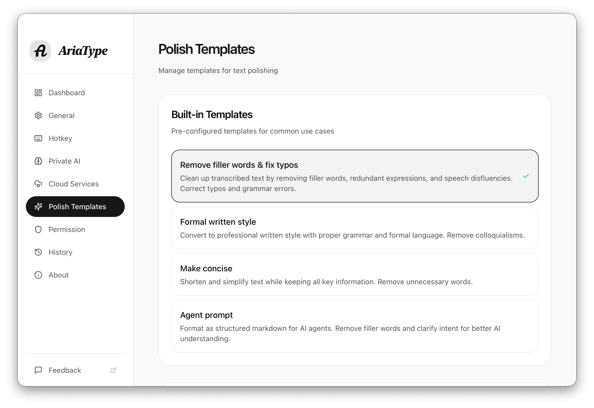</td>
    <td width="50%">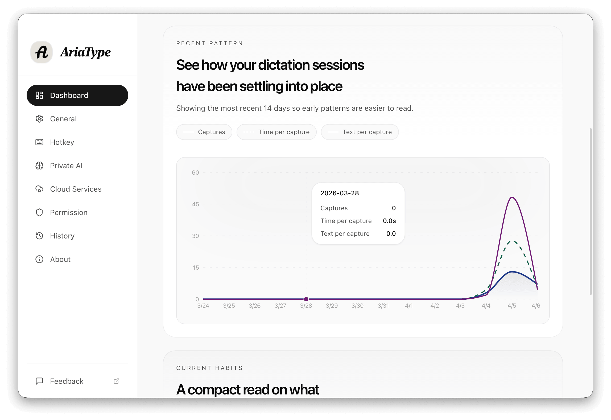</td>
  </tr>
  <tr>
    <td><strong>Plantillas de polish</strong> Empieza con plantillas integradas o crea las tuyas para tareas de escritura repetidas.</td>
    <td><strong>Panel de uso</strong> Mide cuánto usas el dictado por voz, cuánto tarda y cómo evoluciona tu hábito.</td>
  </tr>
  <tr>
    <td width="50%">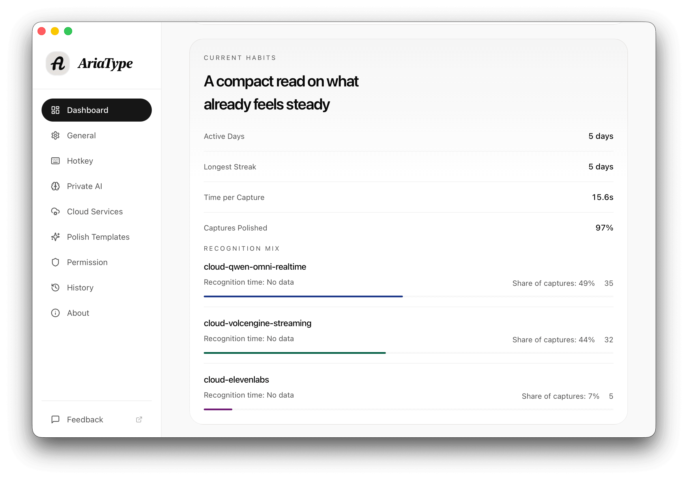</td>
    <td width="50%">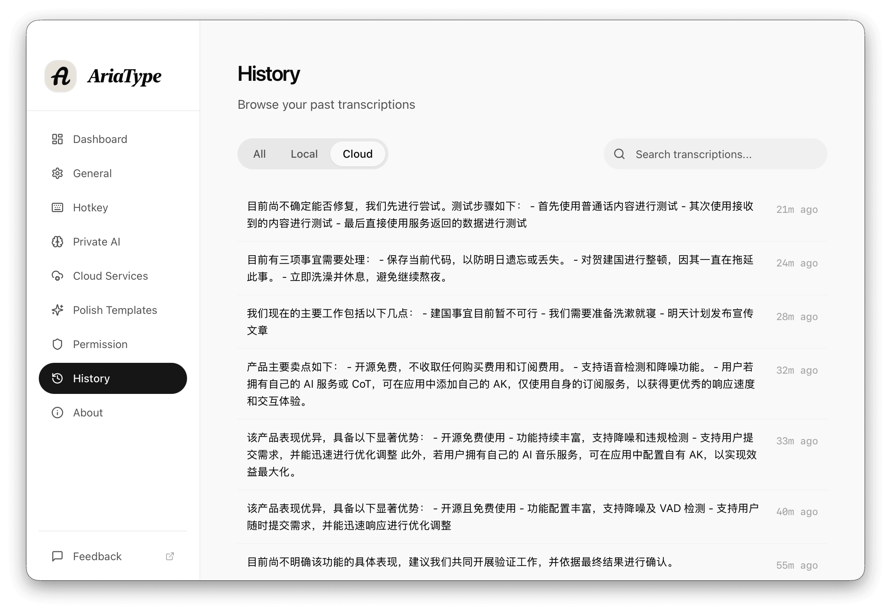</td>
  </tr>
  <tr>
    <td><strong>Estadísticas más detalladas</strong> Revisa proporción local/cloud, rachas de uso y más señales útiles para afinar tu flujo.</td>
    <td><strong>Historial con busqueda</strong> Recorre transcripciones anteriores, filtra por origen y encuentra rapido el texto que quieres reutilizar.</td>
  </tr>
</table>

## Consejos de uso

- Si prefieres trabajar sin conexión y hablas sobre todo en chino, empieza por `SenseVoice`. Suele ser la mejor opción para mandarín, chino tradicional, cantonés y usos centrados en CJK.
- Si trabajas sobre todo en inglés o en otros idiomas internacionales, empieza por `Whisper`. Cubre más idiomas y ofrece más tamaños de modelo y más margen de ajuste.
- Si quieres una base estable, descarga primero el modelo local que vayas a usar y activa los servicios cloud solo para tareas concretas.
- Si ya pagas tu propio servicio de IA, entra en `Cloud Services`, añade tu `API Key` y activa `Cloud STT` o `Cloud Polish` cuando te haga falta.
- Si hablas de forma muy natural y con muchas muletillas, suele ser más cómodo transcribir primero y luego aplicar `Remove Fillers` o `Make Concise`.
- Si manejas vocabulario técnico, define antes el idioma de salida, el dominio, el subdominio y el glosario para mejorar la precisión.
- Coloca la cápsula en un lugar visible pero que no tape contenido; si usas AriaType muchas veces al día, suele funcionar mejor dejarla siempre visible.

## Licencia

AriaType se distribuye bajo [AGPL-3.0](LICENSE).

- Puedes usarlo, modificarlo y redistribuirlo bajo los términos de AGPL-3.0.
- Consulta `LICENSE` para ver el texto legal completo y las obligaciones asociadas.
