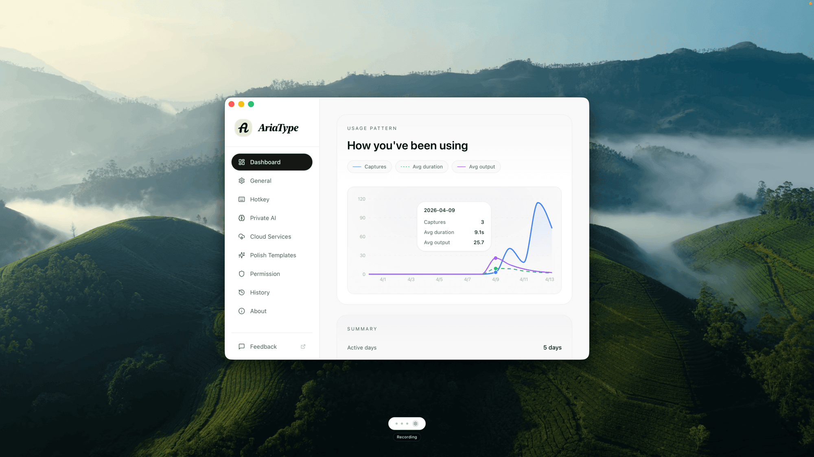

  

### AriaType

AriaType - 오픈소스 AI 음성 텍스트 입력 | Typeless의 강력한 대안

[English](README.md) | [简体中文](README-cn.md) | [日本語](README-ja.md) | 한국어 | [Español](README-es.md)

 [-pink)](https://github.com/joe223/AriaType/releases)  

[다운로드](https://github.com/joe223/AriaType/releases) • [문서](context/README.md) • [토론](https://github.com/joe223/AriaType/discussions) • [웹사이트](https://ariatype.com)

> [!TIP]
> **v0.4 새로운 기능 (2026-04-25)**
> - **Riff 모드** – 자유롭게 말하고, AI가 명확한 텍스트로 다듬어줍니다
> - **3가지 단축키 모드** – Dictate(원문), Riff(다듬기), Custom(사용자 지정)
> - **프로필별 템플릿** – 각 단축키에 고유한 다듬기 스타일 설정

---

## 무엇인가요

AriaType는 macOS용 로컬 우선 음성 입력 앱입니다.

백그라운드에서 대기하다가, 입력이 필요할 때만 꺼내 쓰면 됩니다. 전역 단축키를 누른 채 자연스럽게 말하고 손을 떼면, 말한 내용이 현재 앱에 바로 텍스트로 들어갑니다.

## 핵심 기능

- ⚡️ **빠른 처리** – 평균 전사 시간 500ms 이하, 코딩/작성 속도 향상
- 🔒 **프라이버시 우선** – 기본 로컬 STT/Polish, 음성 데이터 서버로 전송 안 함
- 🎙 **두 개의 단축키** – `Cmd+/` 받아쓰기(원문), `Opt+/` 자동 다듬기
- 🇨🇳 **CJK 친화적** – SenseVoice가 중국어/일본어/한국어에 최적화
- ✨ **스마트 Polish** – 필러 제거, 구두점 수정, 표현 정리 자동 실행
- 🧩 **커스텀 템플릿** – 반복 작업용 맞춤 Polish 스타일 생성
- 🌍 **100+ 언어** – 자동 감지 또는 출력 언어 지정
- ☁️ **클라우드 옵션** – 필요시 API Key로 클라우드 강화 활성화

## 사용 팁

- 중국어/CJK는 `SenseVoice` 사용 – 중국어, 일본어에 최적.
- 영어/국제 언어는 `Whisper` 사용 – 더 넓은 언어 지원.
- 말에 군더더기 많음? 전사 후 `Remove Fillers` 또는 `Make Concise` 적용.
- 전문 용어 있음? 도메인과 용어집 미리 설정.
- 클라우드 STT 설정은 [클라우드 STT 설정 가이드](https://github.com/joe223/AriaType/discussions/3) 참조 – API Key로 더 강력한 인식 활성화.

## 지원 플랫폼

| 플랫폼 | 상태 | 요구사항 |
|-------|------|----------|
| macOS (Apple Silicon) | ✅ 안정 | macOS 12.0+, M 시리즈 |
| macOS (Intel) | ✅ 안정 | macOS 12.0+, Intel Core i5+ |
| Windows | 🔧 WIP | 곧 출시 |

## 설치와 사용

[ariatype.com](https://ariatype.com)에서 다운로드, 설치 후 마이크와 접근성 권한을 허용하면 바로 사용 가능. 계정 등록 불필요, 설정 과정 없음.

## 라이선스

AriaType는 [AGPL-3.0](LICENSE) 라이선스를 사용합니다.

- AGPL-3.0 조건에 따라 자유롭게 사용, 수정, 배포 가능.
- 자세한 내용은 `LICENSE` 파일 참조.