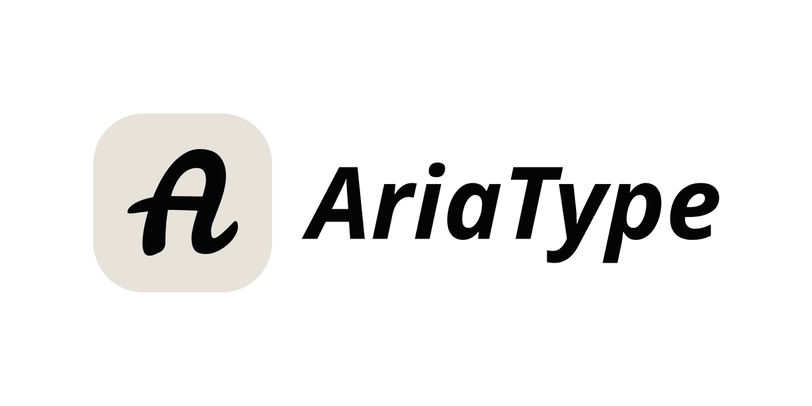

<div align="center">


<br/><br/>




### 개인 정보 보호 중심의 로컬 음성 키보드

**누르고 말하기. 놓으면 입력. 로컬 우선. 프라이버시 우선.**

[English](README.md) | [简体中文](README-cn.md) | [日本語](README-ja.md) | 한국어 | [Español](README-es.md)

[](LICENSE)
[-pink)](https://github.com/SparklingSynapse/AriaType/releases)
[](https://github.com/SparklingSynapse/AriaType/releases)

[다운로드](https://github.com/SparklingSynapse/AriaType/releases) • [문서](#빠른-시작) • [커뮤니티](https://github.com/SparklingSynapse/AriaType/discussions) • [웹사이트](https://ariatype.com)

</div>

---

## ✨ AriaType란?

AriaType는 백그라운드에서 조용히 실행되는 **로컬 우선 음성 키보드**입니다. 입력이 필요할 때 기본 단축키(기본값 `Shift+Space`)를 누른 채로 자연스럽게 말하고, 놓기만 하면 됩니다. AriaType가 음성을 즉시 받아 적어 VS Code, Slack, Notion, 브라우저 등 현재 활성화된 어떤 앱이든 그대로 입력해 줍니다.

음성 인식과 텍스트 다듬기에는 **엄선하고 최적화한 로컬 AI 모델**을 사용합니다. 임의의 모델 조합이 아니라, 작업에 가장 적합한 도구로 구성했습니다.

**음성 데이터는 절대 기기 밖으로 나가지 않습니다. 100% 프라이빗, 100% 로컬.**

---

## 🚀 빠른 시작

### 설치

**macOS (Apple Silicon)**

1. 최신 [.dmg 파일](https://github.com/SparklingSynapse/AriaType/releases) 다운로드
2. .dmg를 열고 AriaType를 Applications로 드래그
3. Applications에서 AriaType 실행

**Windows** 🚧 개발 중

Windows 지원은 현재 개발 중입니다. [이 저장소를 Watch](https://github.com/SparklingSynapse/AriaType)하거나 [토론에 참여](https://github.com/SparklingSynapse/AriaType/discussions)해 업데이트를 확인하세요.

### 최초 설정

1. **권한 허용**: 안내에 따라 마이크 및 손쉬운 사용(Accessibility) 권한 허용
2. **모델 다운로드**: 속도와 정확도의 균형을 위해 **Base** 모델 선택
3. **언어 설정**: 자동 감지도 좋지만, 주 사용 언어를 선택할 수도 있음
4. **사용해 보기**: 아무 텍스트 편집기에서 `Shift+Space`를 누른 채로 “Hello world”라고 말한 뒤 놓기

### 기본 사용법

```
1. 누르기 → Shift+Space(또는 커스텀 단축키)
2. 말하기 → 입력하고 싶은 내용을 말하기
3. 놓기 → 텍스트가 즉시 입력됨
```

---

## 🎯 핵심 기능

### 🔒 프라이버시 우선

음성 데이터는 **절대 컴퓨터 밖으로 나가지 않습니다**. 음성 인식과 텍스트 다듬기 전 과정이 **엄선·최적화된 모델**로 기기 내에서 처리됩니다. 클라우드 없음, 서버 없음, 데이터 수집 없음(익명 분석을 선택한 경우 제외).

### 🎙️ 지능형 노이즈 감소

배경 소음을 자동으로 줄이는 3가지 모드:

- **Auto**: 소음 수준을 감지해 자동으로 조정
- **Always On**: 최대 노이즈 억제
- **Off**: 원본 오디오 입력

### ✨ AI 기반 텍스트 다듬기

**엄선된 로컬 AI 모델**로 말한 내용을 자연스럽게 정리합니다:

- 군더더기 말(“um”, “uh”, “like” 등) 제거
- 문법 및 구두점 수정
- 자연스러운 포맷팅
- 모든 처리가 온디바이스로 진행되어 프라이버시 극대화

### 🌍 100+개 언어

다음을 포함해 다양한 언어를 지원합니다:

- 영어, 중국어(간체/번체)
- 일본어, 한국어, 스페인어, 프랑스어
- 독일어, 이탈리아어, 포르투갈어, 러시아어
- 그 외 90+개 언어

### ⚡ 스마트 기능

- **전역 단축키**: 어떤 앱에서도 동작
- **Smart Pill**: 오디오 레벨을 보여주는 최소한의 플로팅 인디케이터
- **속도/정확도 모드**: 우선순위에 맞게 최적화
- **원탭 리라이트**: Formal, Concise, Fix Grammar를 즉시 적용
- **커스터마이즈**: 단축키, 언어, 동작을 자유롭게 조정

---

## 📋 시스템 요구 사항

- **OS**: macOS 12.0(Monterey) 이상
- **칩**: Apple Silicon(M1, M2, M3, M4)
- **RAM**: 최소 8GB(권장 16GB)
- **저장 공간**: 모델용 2~5GB

---

## 🛠️ 고급 설정

### 단축키 커스터마이즈

Settings → Hotkeys에서 트리거 키 조합을 변경할 수 있습니다.

### 모델 선택

AriaType는 음성 인식과 텍스트 다듬기 모두에 **엄선·최적화된 모델**을 사용합니다:

**음성 인식 모델(Whisper 기반)**:

- **Tiny**: 가장 빠름, 정확도 낮음(~75MB)
- **Base**: 균형(권장)(~150MB)
- **Small**: 더 높은 정확도(~500MB)
- **Medium**: 최고 정확도(~1.5GB)

**텍스트 다듬기**: 문법 교정 및 자연스러운 포맷팅에 최적화된 로컬 LLM이 담당합니다.

모든 모델은 기기 내에서 실행되며, 다운로드 이후에는 인터넷이 필요 없습니다.

### 언어 설정

- **자동 감지**: 말하는 언어를 자동으로 인식
- **고정 언어**: 특정 언어로 고정해 정확도 향상

---

## 💬 커뮤니티 & 지원

- **Issues**: 버그 제보/기능 요청은 [GitHub Issues](https://github.com/SparklingSynapse/AriaType/issues)
- **Discussions**: 커뮤니티 토론은 [GitHub Discussions](https://github.com/SparklingSynapse/AriaType/discussions)
- **웹사이트**: [ariatype.com](https://ariatype.com)

---

## 🤝 기여하기

기여를 환영합니다! 예를 들어:

- 🐛 버그 리포트
- 💡 기능 제안
- 📝 문서 개선
- 🔧 코드 기여

[GitHub](https://github.com/SparklingSynapse/AriaType)에서 이슈 또는 PR을 열어 주세요.

---

## 📄 라이선스

본 프로젝트는 **GNU Affero General Public License v3.0(AGPL-3.0)** 라이선스로 배포됩니다.

의미는 다음과 같습니다:

- ✅ 자유롭게 사용/수정/배포 가능
- ✅ 영구 오픈소스
- ⚠️ 수정 후 배포하는 경우 변경 사항을 공개해야 함
- ⚠️ 수정 버전을 서비스로 운영하는 경우에도 소스 공개 필요

자세한 내용은 [LICENSE](LICENSE)를 참고하세요.

---

## 🌟 프로젝트 응원하기

AriaType가 도움이 되었다면:

- ⭐ 저장소에 Star 남기기
- 🐦 주변에 공유하기
- 💬 커뮤니티 토론 참여하기
- 🐛 버그 제보로 개선에 도움 주기

---

<div align="center">

**Made with ❤️ for developers, writers, and anyone who thinks faster than they type**

[지금 다운로드](https://github.com/SparklingSynapse/AriaType/releases) • [시작하기](#빠른-시작) • [커뮤니티 참여](https://github.com/SparklingSynapse/AriaType/discussions)

</div>
