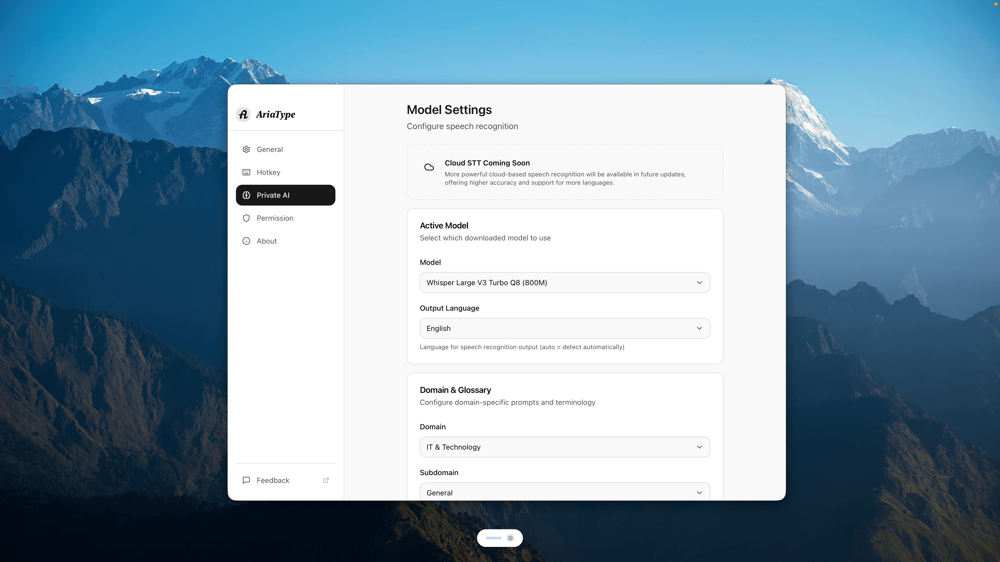

<div align="center">


<br/><br/>


# AriaType

### Your Private, Local Voice Keyboard

**Hold to talk. Release to type. Local-first. Privacy-first.**

[](LICENSE)
[-pink)](https://github.com/SparklingSynapse/aria-type/releases)
[](https://github.com/SparklingSynapse/aria-type/releases)

[Download](https://github.com/SparklingSynapse/aria-type/releases) • [Documentation](#quick-start) • [Community](https://github.com/SparklingSynapse/aria-type/discussions) • [Website](https://ariatype.com)

</div>

---

## ✨ What is AriaType?

AriaType is a **local-first voice keyboard** that runs quietly in the background. When you want to type, just hold a shortcut key (`Shift+Space` by default), speak naturally, and release. AriaType instantly transcribes your speech and types it into any active application—whether it's VS Code, Slack, Notion, or your browser.

Powered by **carefully selected and optimized local AI models** for speech recognition and text polishing—no random model choices, just the best tools for the job.

**Your voice data never leaves your device. 100% private. 100% local.**

---

## 🚀 Quick Start

### Installation

**macOS (Apple Silicon)**

1. Download the latest [.dmg file](https://github.com/SparklingSynapse/aria-type/releases)
2. Open the .dmg and drag AriaType to Applications
3. Launch AriaType from Applications

**Windows** 🚧 Work in Progress

Windows support is currently under development. [Watch this repo](https://github.com/SparklingSynapse/aria-type) or [join discussions](https://github.com/SparklingSynapse/aria-type/discussions) for updates.

### First Time Setup

1. **Grant Permissions**: Allow Microphone and Accessibility access when prompted
2. **Download a Model**: Choose the **Base** model for balanced speed and accuracy
3. **Set Your Language**: Auto-detect works great, or select your primary language
4. **Try it out**: Open any text editor, hold `Shift+Space`, and say "Hello world"

### Basic Usage

```
1. Hold → Shift+Space (or your custom hotkey)
2. Speak → Say what you want to type
3. Release → Text appears instantly
```

---

## 🎯 Key Features

### 🔒 Privacy First
Your voice data **never leaves your computer**. All processing happens locally on your device using **carefully selected, optimized models** for speech recognition and text polishing. No cloud. No servers. No data collection (unless you opt-in to anonymous analytics).

### 🎙️ Intelligent Noise Reduction
Automatically filters background noise with three modes:
- **Auto**: Detects and adapts to noise levels
- **Always On**: Maximum noise suppression
- **Off**: Raw audio input

### ✨ AI-Powered Polish
Automatically cleans up your speech using **carefully curated local AI models**:
- Removes filler words ("um", "uh", "like")
- Fixes grammar and punctuation
- Formats text naturally
- All processing happens on-device for maximum privacy

### 🌍 100+ Languages
Full support for:
- English, Chinese (Simplified/Traditional)
- Japanese, Korean, Spanish, French
- German, Italian, Portuguese, Russian
- And 90+ more languages

### ⚡ Smart Features
- **Global Hotkey**: Works in any application
- **Smart Pill**: Minimal floating indicator with audio levels
- **Speed/Accuracy Modes**: Optimize for what matters most
- **One-Tap Rewrite**: Make text Formal, Concise, or Fix Grammar instantly
- **Customizable**: Adjust hotkeys, languages, and behavior

---

## 📋 System Requirements

- **OS**: macOS 12.0 (Monterey) or later
- **Chip**: Apple Silicon (M1, M2, M3, M4)
- **RAM**: 8GB minimum (16GB recommended)
- **Storage**: 2-5GB for models

---

## 🛠️ Advanced Configuration

### Custom Hotkeys
Go to Settings → Hotkeys to customize your trigger key combination.

### Model Selection

AriaType uses **carefully selected and optimized models** for both speech-to-text and AI polish:

**Speech Recognition Models** (Whisper-based):
- **Tiny**: Fastest, lower accuracy (~75MB)
- **Base**: Balanced (recommended) (~150MB)
- **Small**: Higher accuracy (~500MB)
- **Medium**: Best accuracy (~1.5GB)

**Text Polish**: Powered by curated local LLM optimized for grammar correction and natural language formatting.

All models run entirely on your device—no internet required after download.

### Language Settings
- **Auto-detect**: Automatically identifies the language you're speaking
- **Fixed Language**: Lock to a specific language for better accuracy

---

## 💬 Community & Support

- **Issues**: Report bugs or request features on [GitHub Issues](https://github.com/SparklingSynapse/aria-type/issues)
- **Discussions**: Join the community on [GitHub Discussions](https://github.com/SparklingSynapse/aria-type/discussions)
- **Website**: Visit [ariatype.com](https://ariatype.com) for more information

---

## 🤝 Contributing

We welcome contributions! Whether it's:
- 🐛 Bug reports
- 💡 Feature requests
- 📝 Documentation improvements
- 🔧 Code contributions

Please open an issue or pull request on [GitHub](https://github.com/SparklingSynapse/aria-type).

---

## 📄 License

Licensed under the **GNU Affero General Public License v3.0** (AGPL-3.0).

This means:
- ✅ Free to use, modify, and distribute
- ✅ Open source forever
- ⚠️ If you modify and distribute, you must share your changes
- ⚠️ If you run a modified version as a service, you must share the source

See [LICENSE](LICENSE) for full details.

---

## 🌟 Support the Project

If AriaType helps you be more productive, please:
- ⭐ Star this repository
- 🐦 Share it with others
- 💬 Join our community discussions
- 🐛 Report bugs to help us improve

---

<div align="center">

**Made with ❤️ for developers, writers, and anyone who thinks faster than they type**

[Download Now](https://github.com/SparklingSynapse/aria-type/releases) • [Get Started](#quick-start) • [Join Community](https://github.com/SparklingSynapse/aria-type/discussions)

</div>
